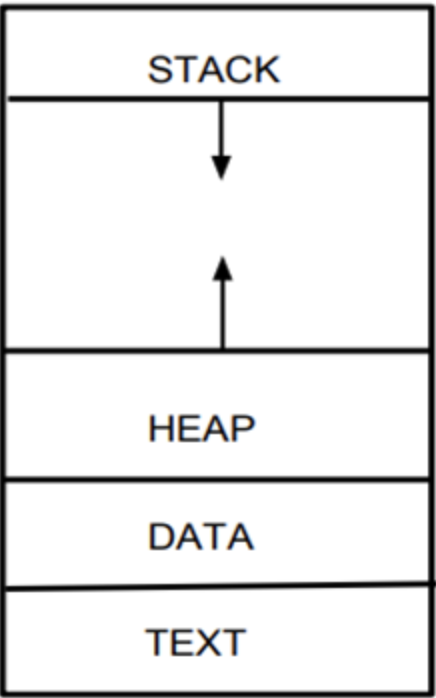
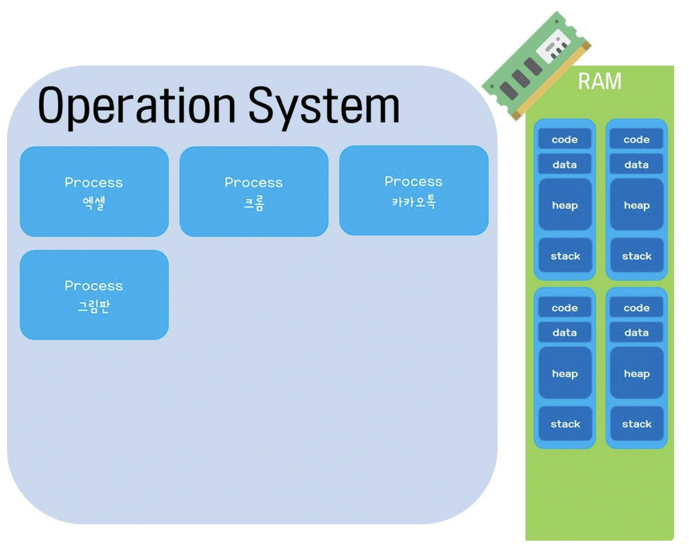
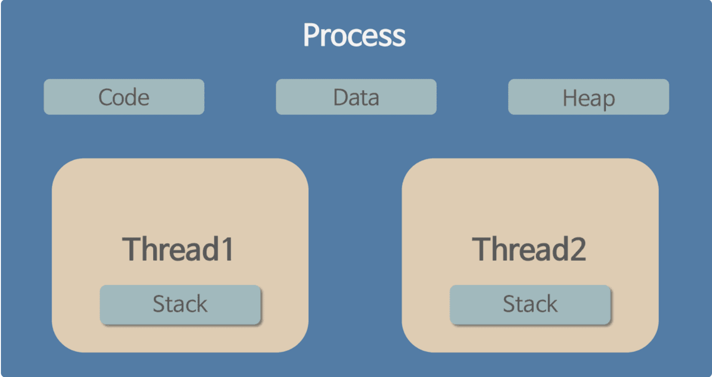
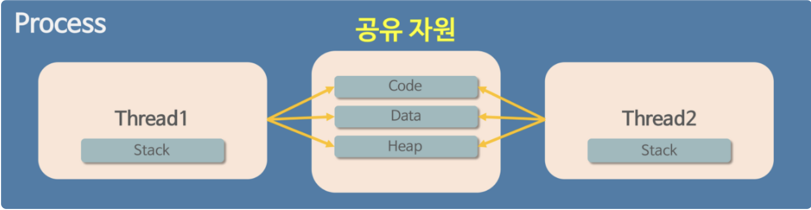
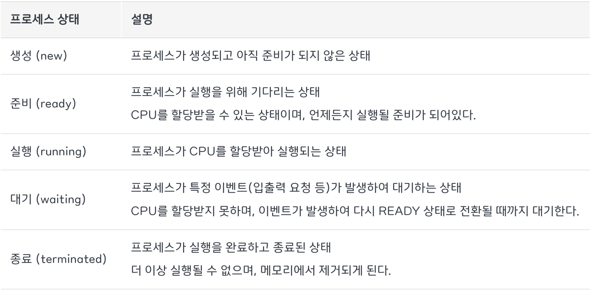
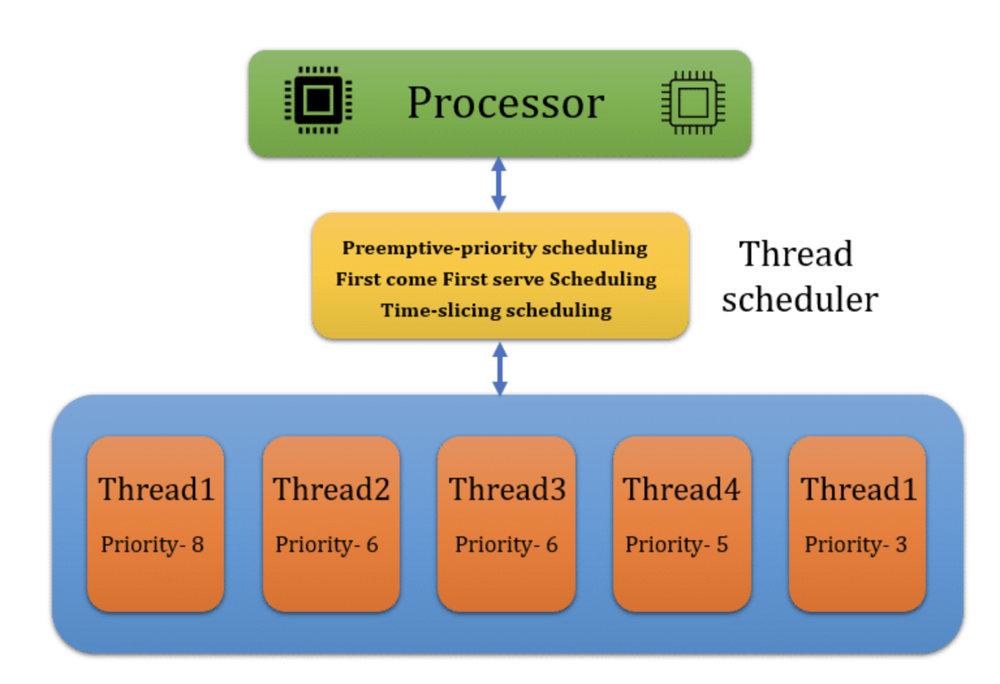
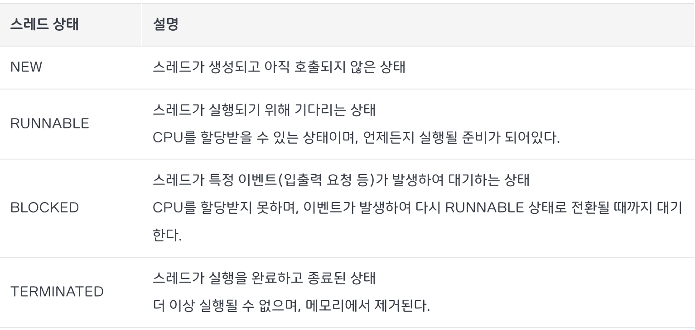
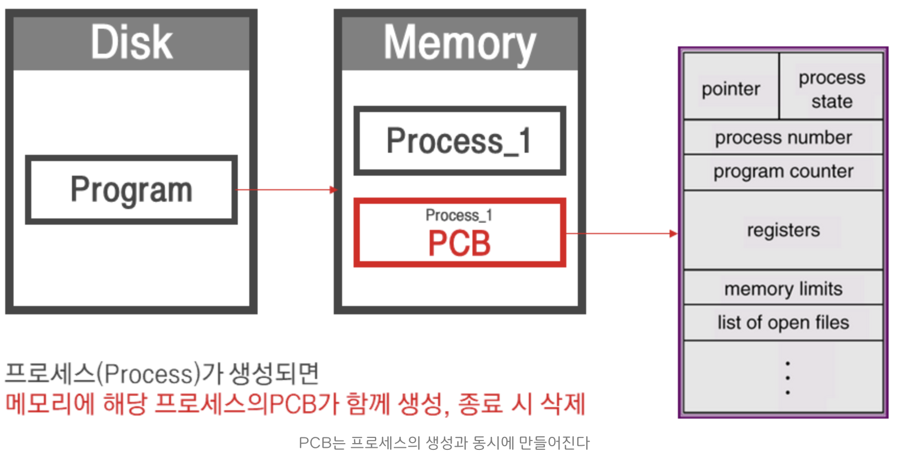
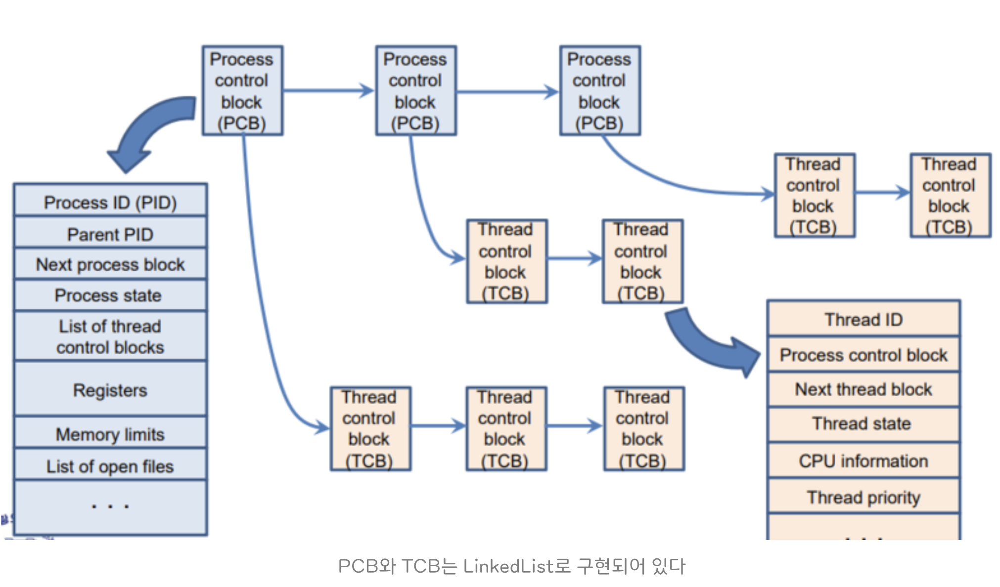

# 프로세스와 스레드

프로세스는 운영체제로부터 작업을 할당 받은 단위이고,
스레드는 프로세스가 할당받은 자원을 이용하는 실행 흐름 단위이다.

## 프로세스

여기서 프로그램과 프로세스를 헷갈릴 수 있는데,
프로그램은 우리 컴퓨터에 있는 exe 파일이라고 생각하면 되고,
프로세스는 그러한 프로그램을 실행시킨 상태라고 보면 된다.

## 스레드

### 프로세스의 한계

과거에는 프로그램을 실행할 때, 프로세스 한 개만을 사용했다.
하지만 시대가 지나며 프로그램이 다채로워지고 복잡해지면서 프로세스 하나만을 이용하기에는 한계가 있었다.

오늘날 컴퓨터를 할 때, 다운로드를 받으며 노래를 듣고 블로그 같은 글을 읽을 수 있는 등의 멀티 작업은 너무나 당연한 것이 되었다.
하지만 과거에는 프로세스를 하나만 사용하기 때문에 이러한 멀티 작업이 불가능했었다.
이를 해결하기 위해서 프로세스 여러 개를 이용하기에는 메모리를 많이 차지하고 CPU에서 할당받는 자원이 중복되게 될 것이다.

그렇다. 스레드는 이러한 문제점을 해결하기 위해 탄생했다.

### 스레드의 개념

스레드란, 하나의 프로세스 내에서 동시에 진행되는 작업 갈래, 흐름의 단위를 말한다.

우리가 크롬 브라우저에서 노래를 듣고 게임을 하며, 유튜브를 볼 수 있는 이유는 크롬이라는 프로세스안에 여러 스레드가 존재하기 때문이다.

크롬처럼 여러 스레드가 있는 것을 멀티 스레드라고 한다.
스레드 수가 많을 수록 동시에 하는 작업이 많아지기 때문에 프로그램의 속도와 성능이 올라간다.

일반적으로 하나의 프로그램은 하나 이상의 프로세스를 가지고 있고, 하나의 프로세스는 하나 이상의 스레드를 가지고 있다.

## 프로세스와 스레드의 메모리

지금부터 프로세스와 스레드의 딥한 부분을 탐구해보도록 하겠다.
위 내용처럼 기초적인 내용만 알고 있다면 좋겠지만, 우리가 가고 싶은 회사의 면접관들은 좀 더 딥한 부분을 알고 있는 개발자를 원한다.

### 프로세스의 자원 구조

프로그램이 실행되어 프로세스가 만들어지면 다음 4가지의 메모리 영역으로 구성되어 할당 받게 된다.

- `STACK`
  지역 변수와 같은 호출한 함수가 종료되면 임시적인 자료를 저장하는 독립적인 공간이다.
  Stack은 함수의 호출과 함께 할당되며, 함수의 호출이 완료되면 소멸한다.
  만일 Stack 영역을 초과하면 Stack overflow 에러가 발생하게 된다.

- `HEAP`
  생성자, 인스턴스와 같은 동적으로 할당되는 데이터들을 위해 존재하는 공간이다.
  사용자에 의해 메모리 공간이 동적으로 할당되고 해제된다.

- `DATA`
  코드가 실행되면서 사용하는 전역 변수나 각종 데이터들이 모여있다.
  데이터영역은 `.data`, `.rodata`, `.bss` 영역으로 세분화된다.
  - `.data` : 전역 변수 또는 static 변수 등 프로그램이 사용하는 데이터를 저장
  - `.rodata` : const 같은 상수 키워드 선언 된 변수나 문자열 상수가 저장
  - `.bss` : 초기값 없는 전역 변수, static 변수가 저장

- `TEXT/CODE`
  프로그래머가 작성한 프로그램 함수들의 코드가 CPU가 해석 가능한 기계어 형태로 저장되어 있다.

STACK 영역과 HEAP 영역에 화살표가 쳐져 있는 이유는
TEXT와 DATA 영역은 선언될 때 크기가 정해지는 정적 영역이지만,
STACK과 HEAP 영역은 프로세스가 실행되는 동안 크기가 늘어났다 줄어들기도 하는 동적 영역이기 때문이다.

프로그램이 여러개 실행된다면 메모리에 프로세스들이 담길 주소 공간이 생성되게 되고 그 안에 STACK, HEAP, DATA, CODE 공간이 만들어지게 된다.

---

### 스레드의 자원 공유

스레드는 프로세스가 할당 받은 자원을 이용하는 실행의 단위로서, 파일을 다운 받으면서 웹서핑을 할 수 있게 해준다. 스레드끼리 프로세스의 자원을 공유하면서 프로세스 실행 흐름의 일부가 되기 때문에 동시 작업이 가능한 것이다.

이때 프로세스의 4가지 메모리 영역(Stack, Heap, Data, Code) 중
스레드는 Stack만 할당 받아 복사하고 Heap, Data, Code는 프로세스내의 다른 스레드들과 공유된다.
따라서 각각의 스레드는 별도의 Stack을 가지고 있지만 Heap 메모리는 고유하기 때문에 서로 다른 스레드에서 가져와 읽고 쓸 수 있게 된다.

### 프로세스의 자원 공유

각 프로세스는 기본적으로 메모리의 별도의 주소 공간에서 실행되기 때문에,
한 프로세스는 다른 프로세스의 변수나 자료구조에 접근할 수 없다.
하지만 늘 그렇듯 방법을 만들어냈다.

IPC(Inter-Process Communication), LPC(Local inter-Process Communication), 별도의 공유 메모리 생성 등의 방법을 사용하면 프로세스도 다른 프로세스와 자원을 공유할 수 있다.

하지만 프로세스 간의 자원 공유는 단순히 CPU 레지스터 교체뿐만 아니라
RAM과 CPU 사이의 캐시 메모리까지 초기화 되기 때문에 자원 부담이 크다는 단점이 있다.
그렇기 때문에 다중 작업이 필요한 경우, 스레드를 사용하는게 효율적이다.

## 프로세스와 스레드의 생명주기

프로세스와 스레드는 각각의 생명주기를 가지고 있어,
운영체제는 이러한 생명주기를 관리하고 프로세스와 스레드를 조정하여 시스템 자원을 효율적으로 사용할 수 있게된다.

### 프로세스 스케줄링

프로세스 스케줄링은 운영체제에서 CPU를 사용할 수 있는 프로세스를 선택하고,
CPU를 할당하는 작업을 말한다.
프로세스 스케줄링은 프로세스의 우선순위, 작업량 등을 고려하여 효율적으로 배치하여,
이를 통해 CPU를 효율적으로 사용하며 시스템 전반적인 성능을 향상시킨다.

스케줄링은 운영체제의 특징과 시스템 요구사항에 따라 다양한 알고리즘 방식으로 동작된다.
알고리즘 종류로는 대표적으로 FCFS, SJF, Priority, RR, Multilevel queue 등이 있다.

### 프로세스 상태

프로세스의 상태는 프로세스가 실행되는 동안 변경되는 고유 상태를 의미한다.
프로세스가 생성되어 실행하기 까지 프로세스는 여러가지 상태를 가지게 되고,
상태의 변화에 따라 프로세스가 동작되는 것이다.
프로세스는 일반적으로 다음과 같은 5가지 상태를 가진다.

### 스레드 스케줄링

프로세스 스케줄링과 마찬가지로 스레드 스케줄링은 운영체제에서 다중 스레드를 관리하며,
CPU를 사용할 수 있는 스레드를 선택하고, CPU를 할당하는 작업을 말한다.
스레드 스케줄링 알고리즘은 프로세스 스케줄링 알고리즘과 유사하게 동작한다.
대표적인 알고리즘으로는 RR, Priority-based scheduling, Multi-level Queue scheduling이 있다.
하지만 스레드는 스케줄링은 하나의 프로세스 내에서 다수의 스레드가 동작하는 형태이기 때문에,
스레드 간의 상호작용과 동기화 문제를 고려해야 한다는 차이점이 존재한다.

### 스레드 상태

프로세스와 마찬가지로 스레드에도 상태가 있다. 다음과 같은 4가지 상태가 있다.

## 컨텍스트 스위칭

컨텍스트 스위칭은 CPU가 한 프로세스에서 다른 프로세스로 전환될 때 발생하는 일련의 과정을 말한다.
프로세스 뿐만 아닌 스레드에서도 컨텍스트 스위칭을 진행한다.

컨텍스트 스위칭을 좀더 구체적으로 말하자면,
동작 중인 프로세스가 대기를 하면서 해당 프로세스의 상태를 보관하고,
대기하고 있던 다음 순서의 프로세스가 동작하면서 이전에 보관했던 프로세스의 상태를 복구하는 작업을 말한다.
다음번 프로세스는 스케줄러가 정하기 때문에 컨텍스트 스위칭의 주체는 스케줄러라고 할 수 있다.

### 프로세스 컨텍스트 스위칭

프로세스에서 컨텍스트 스위칭을 하려면 PCB라는 프로세스 제어 블록이 필요하다.

프로세스 컨텍스트 스위칭을 할 때,
기존 프로세스의 상태를 어딘가에 저장해 둬야 다음에 똑같은 작업을 이어서 할 수 있는데,
상태를 저장해 두는 곳이 PCB이다.

### 스레드 컨텍스트 스위칭

스레드 컨텍스트 스위칭은 멀티 스레딩 환경에서 스레드 간의 실행을 전환하는 기술이다.
프로세스 내의 스레드를

PCB 처럼 TCB가 존재한다.
TCB는 각 스레드마다 운영 체제에서 유지하는 스레드에 대한 정보를 담고 있는 자료구조이다.
TCB는 PCB 안에 있다. 스레드가 프로세스 안에 있는 것처럼 말이다.

